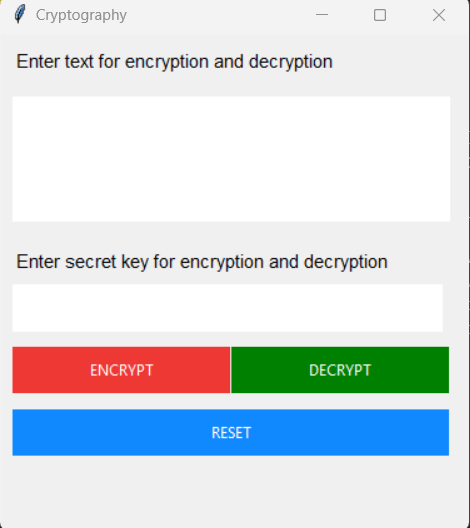

# Cryptography Application

This is a simple cryptography application built using Python and Tkinter. The application allows users to encrypt and decrypt messages using a base64 encoding scheme with a password for access control.

# Output


## Features

- **Encrypt Messages:** Convert plain text messages into base64 encoded strings.
- **Decrypt Messages:** Convert base64 encoded strings back into plain text.
- **Password Protection:** Access to the encryption and decryption functions is protected by a password.

## Requirements

- Python 3.x
- Tkinter (comes pre-installed with standard Python distribution)

## Installation

1. Clone the repository to your local machine:
   ```sh
   git clone https://github.com/Binduvarsha23/cryptography-app.git
   ```

2. Navigate to the project directory:
   ```sh
   cd cryptography-app
   ```

3. Run the application:
   ```sh
   python app.py
   ```

## Usage

1. **Enter Text:** Type the text you want to encrypt or decrypt into the provided text box.

2. **Enter Password:** Type the password `234` into the password field. This password is required to access the encryption and decryption functions.

3. **Encrypt:**
   - Click the "ENCRYPT" button.
   - A new window will open displaying the encrypted message.

4. **Decrypt:**
   - Click the "DECRYPT" button.
   - A new window will open displaying the decrypted message.

5. **Reset:**
   - Click the "RESET" button to clear the text and password fields.

## Code Explanation

### Main Functions

- **encrypt():**
  - Checks if the password is correct.
  - Encodes the message to ASCII bytes, then to base64 bytes, and finally to a base64-encoded ASCII string.
  - Displays the encrypted message in a new window.

- **decrypt():**
  - Checks if the password is correct.
  - Decodes the base64 message to ASCII bytes, then to the original ASCII string.
  - Displays the decrypted message in a new window.

### Main Screen

- **main_screen():**
  - Sets up the main application window with text input, password input, and buttons for encrypt, decrypt, and reset functions.

### Additional Functions

- **reset():** Clears the text input and password fields.

### Example Code

```python
from tkinter import *
from tkinter import messagebox
import base64
import os

def encrypt():
    password = code.get()
    if password == "234":
        screen1 = Toplevel(screen)
        screen1.title("encryption")
        screen1.geometry("400x200")
        screen1.configure(bg="#ed3833")
        message = text1.get(1.0, END)
        encode_message = message.encode("ascii")
        base64_bytes = base64.b64encode(encode_message)
        encrypt = base64_bytes.decode("ascii")

        Label(screen1, text="ENCRYPT", font="arial", fg="white", bg="#ed3833").place(x=10, y=0)
        text2 = Text(screen1, font="robote 10", bg="white", relief=GROOVE, wrap=WORD, bd=0)
        text2.place(x=10, y=40, width=380, height=150)

        text2.insert(END, encrypt)
    elif password == "":
        messagebox.showerror("encryption", "Input Password")
    else:
        messagebox.showerror("encryption", "Invalid Password")

def decrypt():
    password = code.get()
    if password == "234":
        screen2 = Toplevel(screen)
        screen2.title("decryption")
        screen2.geometry("400x200")
        screen2.configure(bg="green")
        message = text1.get(1.0, END)
        encode_message = message.encode("ascii")
        base64_bytes = base64.b64decode(encode_message)
        encrypt = base64_bytes.decode("ascii")

        Label(screen2, text="DECRYPT", font="arial", fg="white", bg="green").place(x=10, y=0)
        text2 = Text(screen2, font="robote 10", bg="white", relief=GROOVE, wrap=WORD, bd=0)
        text2.place(x=10, y=40, width=380, height=150)

        text2.insert(END, encrypt)
    elif password == "":
        messagebox.showerror("encryption", "Input Password")
    else:
        messagebox.showerror("encryption", "Invalid Password")

def main_screen():
    global screen
    global code
    global text1
    screen = Tk()
    screen.geometry("375x398")
    screen.title("Cryptography")

    def reset():
        code.set("")
        text1.delete(1.0, END)

    Label(text="Enter text for encryption and decryption", fg="black", font=("calbri", 11)).place(x=10, y=10)
    text1 = Text(font="Robote 20", bg="white", relief=GROOVE, wrap=WORD, bd=0)
    text1.place(x=10, y=50, width=350, height=100)
    Label(text="Enter secret key for encryption and decryption", fg="black", font=("calbri", 11)).place(x=10, y=170)
    code = StringVar()
    Entry(textvariable=code, width=19, bd=0, font=("arial", 24), show="*").place(x=10, y=200)
    Button(text="ENCRYPT", height="2", width=18, bg="#ed3833", fg="white", bd=0, command=encrypt).place(x=10, y=250)
    Button(text="DECRYPT", height="2", width=18, bg="green", fg="white", bd=0, command=decrypt).place(x=185, y=250)
    Button(text="RESET", height="2", width=40, bg="#1089ff", fg="white", bd=0, command=reset).place(x=10, y=300)

    screen.mainloop()

main_screen()
```

## License

This project is licensed under the MIT License. See the [LICENSE](LICENSE) file for details.
```
